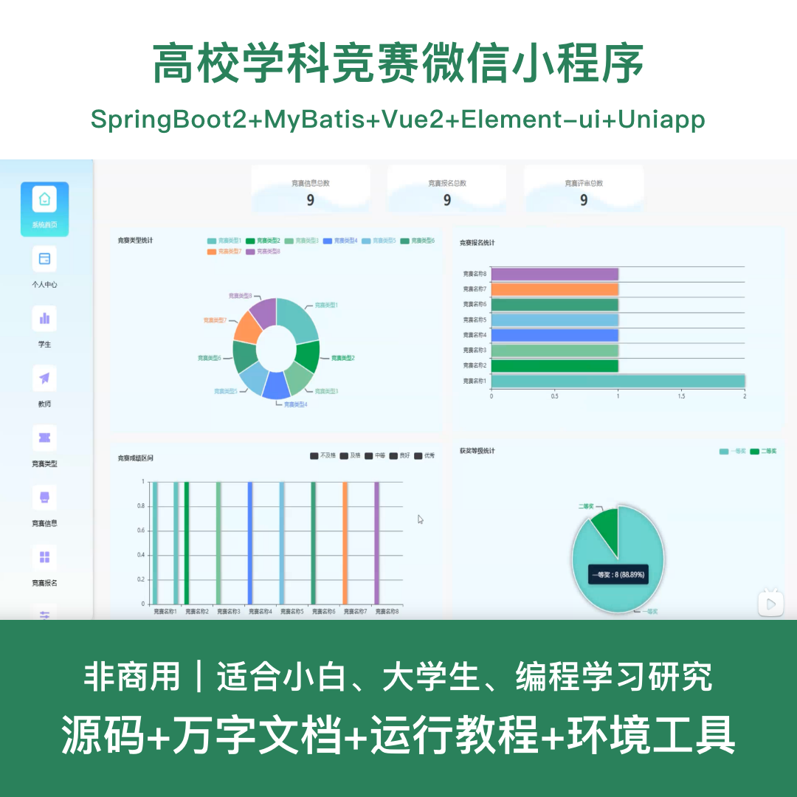
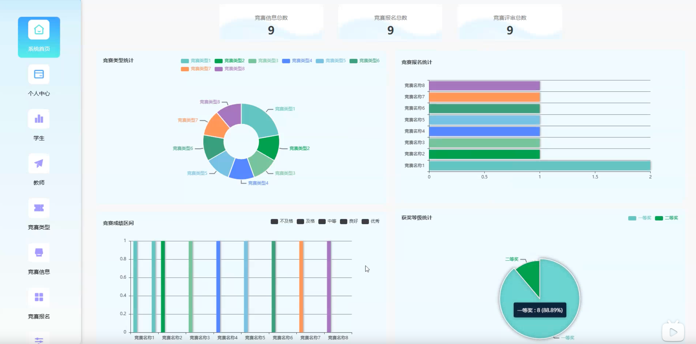
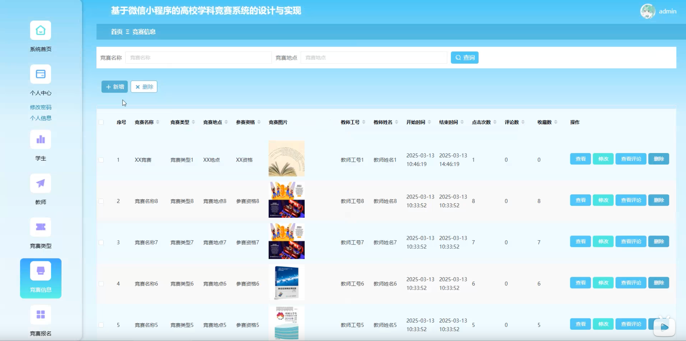
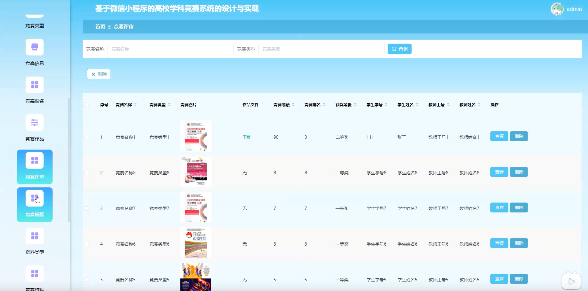
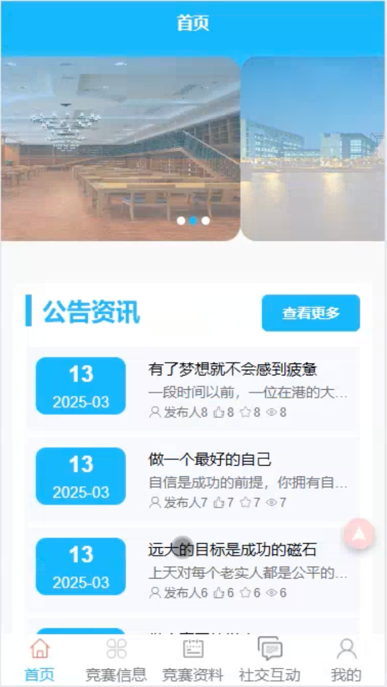
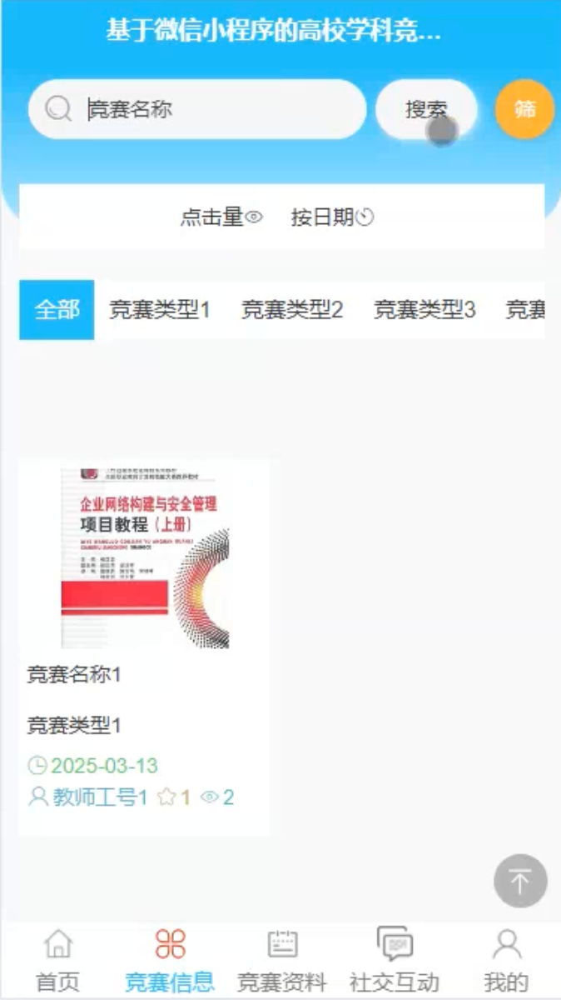
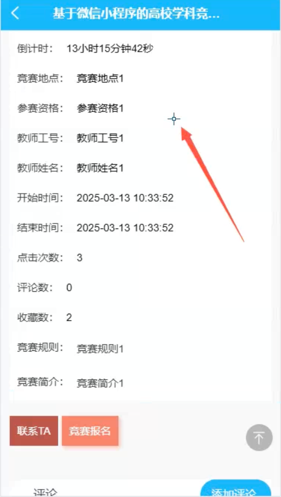
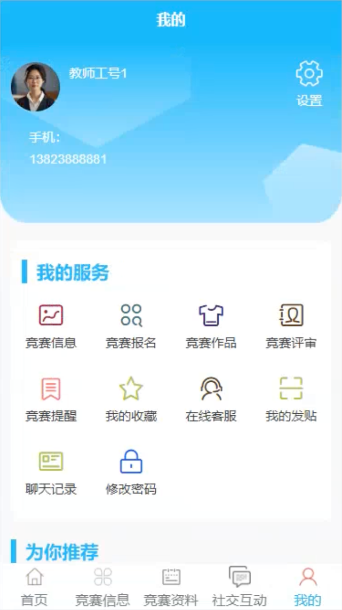

# mpweixinA232D
mpweixinA232D高校学科竞赛微信小程序+LW
 
## 源码问题查看主页咨询

### 一、关键词
学科竞赛系统、竞赛管理系统、比赛管理系统、竞赛报名系统、学科竞赛平台

### 二、作品包含
源码+数据库+万字设计文档+全套环境和工具资源+本地部署教程

### 三、项目技术
前端技术： Html、Css、Js、Vue2.6、Element-ui、uniapp
后端技术：Java、SpringBoot2.2.2、MyBatis

### 四、运行环境（以下版本亲测，其他版本兼容性请自行测试）
开发工具：IDEA/eclipse + VSCODE + HBuilder X + 微信开发者工具

数据库：MySQL 5.7+

数据库管理工具：Navicat10以上版本

环境配置软件： JDK1.8 + Maven3.6+

前端Nodejs：14+

浏览器：谷歌浏览器

### 五、项目介绍
项目编号：mpweixinA232D

基于微信小程序的高校学科竞赛系统，为学生、教师提供便捷的竞赛信息发布、报名、作品提交、评审等功能，提升高校学科竞赛管理效率。

角色：管理员、学生、教师

学生功能：注册登录、浏览竞赛信息、竞赛报名、查看竞赛资料、提交竞赛作品、查看评审结果、个人中心。

教师功能：注册登录、查看竞赛信息、竞赛评审、查看学生作品、评分管理、个人中心。

管理员功能：登录、学生管理、教师管理、竞赛信息管理、竞赛类型管理、竞赛题型管理、竞赛报名管理、竞赛作品管理、竞赛评审管理、竞赛资料管理、资料类型管理。

数据库表：24个

### 六、运行截图

